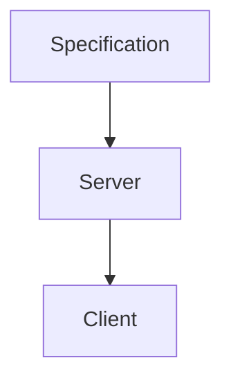

# blog-spec

This repository defines the common contract between the [blog-server](https://github.com/SikoSoft/blog-server) and [blog-client](https://github.com/SikoSoft/blog-client) repositories, and the abstract models and specifications they both should adhere to.

# Order of authority

Generally speaking, this specification aims to be high level and not concern itself much in the way of implementation detail. Because these documents and guidelines outline the design of a HATEOAS system, it stands to reason that the goal of these specifications should first and foremost guide the underlying API server. As a HATEOAS designed system entails, the client UI application should therefor conform its behavior as directed by the server.

